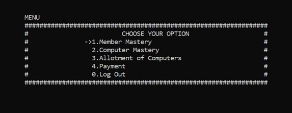
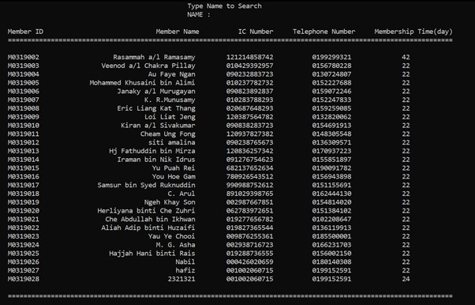
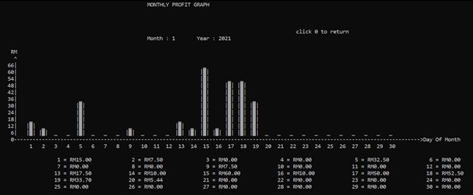

# Cybercafe Management System

A simple CLI app built with C++ for managing a cybercafe. It allows admins to manage memberships, allocate computers to customers, handle payments, and track profits. My first uni course project.

## Features
- **Manage Memberships**: Add, update, and remove members.
- **Manage Computers**: View and allocate computers.
- **Allocate Computers**: Assign computers to customers and manage their session.
- **Payments**: Track and manage customer payments.
- **Statistics**: View daily and monthly profit graphs.
- **Real-time Allocation Status**: See current computer allocation, time left, and end time.

## Navigation
- Use **arrow keys** to navigate the UI.

## Screenshot
  
menu selection  
  
allocating status  
  
membership search and select  
  
admin login  
  
membership topup  
  
monthly profit graph  
  
yearly profit graph  

## demonstration video
https://youtu.be/ywdCPdPMZJ4

## License
This project is licensed under the MIT License.
